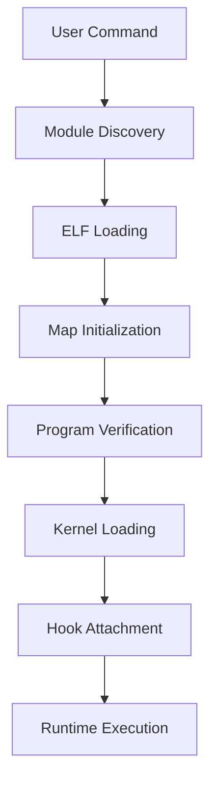

# Architecture

## Overview

The eBPF Packet Loss Emulator is built around a modular architecture that separates user-space orchestration logic from kernel-space packet processing logic.

The framework consists of two primary components:

- A user-space control plane responsible for module management, configuration, monitoring, and runtime interaction.
- A collection of dynamically loadable eBPF programs responsible for packet processing within the Linux kernel.

This separation enables new packet impairment models to be integrated without requiring modifications to the framework's core infrastructure, while preserving a consistent management interface across all modules.

The architecture has been designed around three primary objectives:

- Modularity;
- Extensibility;
- Runtime configurability.

---

## What is eBPF?

Extended Berkeley Packet Filter (eBPF) is a programmable execution environment embedded within the Linux kernel that enables the safe execution of user-defined code without requiring custom kernel modules.

Originally derived from the Berkeley Packet Filter (BPF) packet filtering mechanism, eBPF has evolved into a general-purpose kernel instrumentation and packet processing framework capable of extending kernel functionality across multiple subsystems.

eBPF programs execute within a sandboxed virtual machine embedded in the kernel. Before execution, every program is validated by the kernel verifier to ensure:

- Memory safety;
- Bounded execution;
- Type correctness;
- Safe pointer usage;
- Absence of unsafe kernel interactions.

Programs that fail verification are rejected before deployment, preventing crashes, deadlocks, and other forms of kernel instability.

Today, eBPF is widely adopted across multiple domains, including:

- High-performance packet processing;
- Traffic engineering and filtering;
- System observability;
- Performance profiling;
- Security monitoring;
- Runtime tracing;
- Container networking;
- Service mesh implementations.

Because eBPF programs execute directly within kernel execution paths, they can observe and manipulate packets with significantly lower overhead than traditional user-space solutions.

---

## Why eBPF?

The decision to use eBPF as the foundation of the packet loss emulator was motivated by several architectural and operational advantages.

### Performance

eBPF programs execute directly within packet processing paths, eliminating expensive user-space context switches.

Furthermore, execution models such as XDP Native and XDP Hardware Offload enable packet processing to occur closer to the network hardware, reducing latency and CPU utilisation.

### Flexibility

eBPF programs can be loaded, unloaded, and replaced dynamically at runtime.

This capability allows packet impairment models to be modified without requiring kernel recompilation, application restarts, or system reboots.

### Safety

All programs must successfully pass kernel verification before execution.

The verifier ensures that deployed programs cannot perform unsafe memory operations, execute unbounded loops, or compromise kernel stability.

### Observability

eBPF provides direct access to kernel-level telemetry and execution statistics.

This enables the collection of detailed runtime metrics and packet processing information that would otherwise be difficult or impossible to obtain using conventional user-space tooling.

---

## ELF Format and Program Loading

eBPF programs are typically compiled into ELF (Executable and Linkable Format) object files.

An ELF object contains not only the eBPF bytecode itself, but also metadata describing:

- Program sections;
- BPF maps;
- Relocation information;
- Configuration structures;
- License declarations;
- Program entry points.

The framework's loader parses ELF objects and inspects framework-specific sections that expose module metadata. These sections are used to identify configuration keys, runtime capabilities, and attachment requirements without requiring loader modifications for each new eBPF module. By analysing the available sections, the loader can also determine whether a module targets XDP or TC and apply the appropriate loading and attachment workflow automatically.

This architecture establishes a clear separation between:

- User-space orchestration logic;
- Kernel-space packet processing logic.

As a consequence, new eBPF modules can be developed independently from the loader, simplifying extensibility and long-term maintenance.

---

## Architectural Components

The framework is composed of several loosely coupled subsystems that collectively provide module discovery, program loading, runtime configuration, statistics collection, and packet processing capabilities.

A strict separation is maintained between user-space control logic and kernel-space execution logic, enabling both layers to evolve independently while preserving a stable interface.

### User-Space Components

The user-space implementation acts as the framework's control plane.

Its responsibilities include:

- Runtime initialization and cleanup;
- Interactive CLI management;
- Module discovery;
- eBPF program loading and unloading;
- Attachment-point management;
- Runtime configuration updates;
- Statistics retrieval and presentation;
- Signal handling;
- Communication with BPF maps.

During framework initialization, the setup subsystem ensures that all required runtime structures are created and that the build output directory contains the compiled eBPF modules required by the loader. The framework expects compiled ELF objects to be available in the build directory, regardless of whether they were generated during setup or previously compiled through the project's Makefile. Since both mechanisms produce the same build artifacts in the same location, invoking either process is sufficient and does not introduce conflicts.

The primary user-space subsystems are:

| Component              | Responsibility                                              |
| ---------------------- | ----------------------------------------------------------- |
| `main.c`               | Application entry point and lifecycle coordination          |
| `cli/`                 | Interactive command-line interface                          |
| `cli/commands/`        | Individual command implementations                          |
| `core/bpf_manager.*`   | Module loading, unloading, attachment, and detachment logic |
| `core/configuration.*` | Runtime configuration management for loaded modules         |
| `core/reporting.*`     | Statistics retrieval, aggregation, and export functionality |
| `core/setup.*`         | Runtime initialization and environment preparation          |
| `core/cleanup.*`       | Resource cleanup and shutdown                               |
| `utils/`               | Shared utility functions                                    |

This separation decouples framework operations from the CLI commands that invoke them. Command handlers act primarily as an interface layer, while module lifecycle management, runtime configuration, and statistics reporting are implemented within dedicated subsystems. This design improves maintainability, simplifies future extensions, and promotes a clearer separation of responsibilities across the control plane.

---

### Kernel-Space Components

The kernel-space implementation contains the eBPF programs responsible for packet processing.

```text
src/
└── kernel-space/
    └── bpf/
        └── modules/
```

Each module implements a specific packet impairment strategy and is compiled into an independent ELF object file.

Shared definitions, helper functions, and reusable components are located within the framework's common header and utility directories, enabling functionality to be reused across multiple modules.

---

## Loader Architecture

The loader is the core runtime subsystem responsible for managing the complete lifecycle of eBPF modules.

Its responsibilities include:

1. Module discovery;
2. ELF object loading;
3. BPF map initialization;
4. Program verification;
5. Kernel loading;
6. Hook attachment;
7. Runtime configuration;
8. Statistics collection;
9. Module detachment and cleanup.

The loading workflow can be summarised as follows:



This design completely decouples module implementation from the loading infrastructure, allowing new modules to be integrated without requiring modifications to the loader itself.

---

## Module Discovery

The framework automatically discovers all compiled eBPF modules available within the module directory:

```text
build/kernel-space/bpf/modules/
```

Compiled module objects may be generated either through the project's Makefile or through the framework setup process. In both cases, the resulting ELF files are placed in the build directory and become available for discovery by the loader.

Discovered modules are exposed through the `list` command and can be dynamically loaded through the CLI.

This approach eliminates hardcoded module registration and enables a plug-in style architecture in which newly added modules become immediately available after compilation.

---

## Program Lifecycle

Each eBPF module follows a well-defined lifecycle:

1. Compilation (`.bpf.c` → ELF object);
2. Discovery;
3. Loading;
4. ELF parsing;
5. Map initialization;
6. Program verification;
7. Kernel loading;
8. Hook attachment;
9. Runtime execution;
10. Statistics collection;
11. Detachment;
12. Cleanup.

The entire lifecycle is managed by the framework, allowing module developers to focus exclusively on packet processing behaviour.

---

## Design Principles

The framework has been designed to support future expansion beyond packet loss emulation.

Several architectural decisions were made to facilitate long-term maintainability and extensibility:

- Dynamic module discovery without hardcoded registration.
- Compatibility with both Makefile-based and setup-driven module compilation workflows.
- Runtime configuration through BPF maps.
- Separation of control-plane and data-plane responsibilities.
- Attachment-point abstraction through the loader.
- Consistent module interfaces across execution contexts.
- Reusable infrastructure for future impairment models.

These design choices allow the framework to evolve towards more advanced packet impairment mechanisms while preserving a stable user experience and development workflow.

<div style="display:flex; justify-content:space-between;">
<a href="../../user-guides/getting-started/cleanup.md"
   style="
      display:inline-block;
      padding:6px 16px;
      border:1px solid #dadde1;
      border-radius:8px;
      text-decoration:none;
      line-height:1.4;
   ">

   <div style="font-size:0.75rem; color:#6b7280;">
      Previous
   </div>
   <div style="font-weight:600;">
      Cleanup
   </div>
</a>

<a href="networking-stack.md"
   style="
      display:inline-block;
      padding:6px 16px;
      border:1px solid #dadde1;
      border-radius:8px;
      text-decoration:none;
      text-align:right;
      line-height:1.4;
   ">

   <div style="font-size:0.75rem; color:#6b7280;">
      Next
   </div>
   <div style="font-weight:600;">
      Networking Stack
   </div>
</a>
</div>
