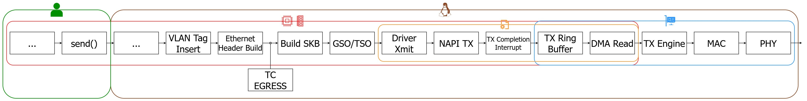
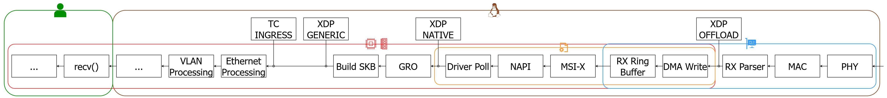

# Networking Stack and Attachment Points

## Overview

The behaviour, performance characteristics, and packet visibility of an eBPF program are largely determined by its position within the Linux networking stack.

Because the framework supports both eXpress Data Path (XDP) and Traffic Control (TC), understanding how packets traverse the networking subsystem is essential when selecting an attachment point for packet loss emulation.

This document provides a high-level overview of the Linux packet processing pipeline and explains the execution context available at each supported attachment point.

---

## Linux Networking Stack

The Linux networking stack consists of a collection of hardware and software components responsible for transmitting and receiving packets between applications and network interfaces.

At a high level, packet processing can be divided into two directions:

- **Ingress**, when packets enter the system from the network.
- **Egress**, when packets leave the system and are transmitted to the network.

The framework allows packet loss emulation to be applied at multiple stages of this processing pipeline through XDP and TC attachment points.

### Legend

The following symbols are used throughout the networking stack diagrams to represent the various hardware and software components involved in packet processing.

| Symbol                                                                                     | Component                          | Description                                                                                             |
| ------------------------------------------------------------------------------------------ | ---------------------------------- | ------------------------------------------------------------------------------------------------------- |
|                | Linux Kernel                       | Components and subsystems executing within kernel space.                                                |
|                   | User Space                         | User applications and processes interacting with the networking stack.                                  |
|                 | System Memory (RAM)                | Main memory used to store packet buffers, SKBs, descriptors, and runtime data structures.               |
|                           | CPU                                | Processing units responsible for executing networking and application workloads.                        |
|  | Network Interface Controller (NIC) | Hardware device responsible for transmitting and receiving network traffic.                             |
|             | Network Driver                     | Software component providing the interface between the Linux networking subsystem and the NIC hardware. |

---

## Core Concepts

Before discussing attachment points, it is useful to understand several fundamental networking structures used throughout the Linux kernel.

### Socket Buffers (SKBs)

The Socket Buffer (`sk_buff`) is the primary packet representation used by the Linux networking subsystem.

An SKB contains:

- Packet payload data;
- Protocol headers;
- Routing information;
- Interface metadata;
- Various kernel networking structures.

Most networking subsystems, including Traffic Control, Netfilter, and routing components, operate on SKBs.

The presence or absence of an SKB is one of the most important distinctions between XDP and TC execution contexts.

---

### Direct Memory Access (DMA)

Modern network interfaces use Direct Memory Access (DMA) to transfer packets between the NIC and system memory.

DMA allows packet data to be moved without continuous CPU involvement, reducing processing overhead and improving throughput.

Both ingress and egress packet paths rely heavily on DMA operations.

---

### Packet Offloading

Modern Linux systems employ several offloading mechanisms to improve networking performance.

Examples include:

- **GSO (Generic Segmentation Offload)**;
- **TSO (TCP Segmentation Offload)**;
- **GRO (Generic Receive Offload)**.

These optimisations reduce per-packet processing overhead by aggregating or segmenting packets more efficiently.

Although largely transparent to the framework, these mechanisms influence where packets appear within the networking stack and can affect packet processing behaviour under high traffic loads.

---

## Egress Packet Path

The egress path describes the sequence of operations performed when an application transmits data through a network interface.

A simplified packet flow is illustrated below:

Packets travelling through the egress path can be intercepted by **TC egress** immediately before they are handed to the network driver for transmission.

At this stage, packets have already been fully constructed and contain complete protocol and routing information.

---

## Ingress Packet Path

The ingress path describes the sequence of operations performed when packets arrive from the network and are delivered to applications.

A simplified packet flow is illustrated below:

Unlike the egress path, ingress processing provides multiple interception points before packets reach higher networking layers.

As a result, different attachment mechanisms offer different trade-offs between performance and packet visibility.

---

## XDP Attachment Points

eXpress Data Path (XDP) is designed to execute eBPF programs as early as possible during packet reception.

Because packets can be processed before traversing most of the networking stack, XDP offers extremely high throughput and low latency.

### XDP Generic

XDP Generic executes after SKB allocation within the conventional networking stack.

Advantages:

- Broad hardware compatibility.
- No driver-specific support required.

Limitations:

- Highest overhead among XDP modes.
- Lower performance than Native and Offload modes.

---

### XDP Native

XDP Native executes directly within the network driver's receive path before SKB creation.

Advantages:

- Significantly lower latency.
- Higher packet throughput.
- Reduced CPU overhead.

Limitations:

- Requires driver support.

This is generally the preferred XDP execution mode when available.

---

### XDP Hardware Offload

XDP Offload executes directly on supported network interface hardware.

Advantages:

- Extremely low latency.
- Minimal CPU utilisation.
- Highest packet processing performance.

Limitations:

- Limited hardware support.
- Reduced packet context.
- Vendor-dependent capabilities.

---

## Traffic Control Attachment Points

Traffic Control (TC) operates at a higher level of the networking stack and relies on SKBs.

Unlike XDP, TC supports both ingress and egress packet processing.

Although TC introduces additional processing overhead, it provides significantly richer packet context.

### TC Ingress

TC ingress executes after packet reception and after the packet has been converted into an SKB.

Advantages:

- Full access to packet metadata.
- Access to routing and protocol state.
- Suitable for advanced packet inspection and manipulation.

### TC Egress

TC egress executes immediately before packets are transmitted through the network driver.

Advantages:

- Complete packet visibility.
- Access to fully constructed protocol headers.
- Ideal for packet impairment and traffic engineering experiments.

This attachment point is commonly used by packet loss emulation modules because it provides the richest execution context.

---

## Attachment Point Comparison

| Attachment Point | Execution Context   | Packet Visibility | Performance |
| ---------------- | ------------------- | ----------------- | ----------- |
| XDP Offload      | NIC Hardware        | Limited           | Very High   |
| XDP Native       | Driver Receive Path | Limited           | High        |
| XDP Generic      | SKB Layer           | Moderate          | Medium      |
| TC Ingress       | Networking Stack    | Extensive         | Medium      |
| TC Egress        | Networking Stack    | Extensive         | Medium      |

---

## Selecting an Attachment Point

The choice of attachment point depends on the goals of the experiment.

Use **XDP** when:

- Maximising throughput is critical.
- Minimising latency is required.
- Early packet dropping is desired.

Use **TC** when:

- Detailed packet inspection is required.
- Access to protocol metadata is important.
- Traffic engineering and impairment experiments are being performed.

For most packet loss emulation scenarios, TC provides the most flexible execution environment, whereas XDP provides the highest performance.

  
  

